# OSCAR Mobile Pro — User Technical Manual

**Version:** 1.0  
**Date:** April 2026  
**Prepared by:** NovaLab Team  
**Platform:** Web-based mobile application (React + Express)

---

## Table of Contents

1. [Introduction](#1-introduction)
2. [System Requirements](#2-system-requirements)
3. [Getting Started — Installation & Setup](#3-getting-started--installation--setup)
4. [Signing In](#4-signing-in)
5. [Home Screen Overview](#5-home-screen-overview)
6. [Managing Patients](#6-managing-patients)
   - 6.1 [Browsing the Patient List](#61-browsing-the-patient-list)
   - 6.2 [Viewing a Patient Record](#62-viewing-a-patient-record)
   - 6.3 [Viewing Appointment History](#63-viewing-appointment-history)
   - 6.4 [Viewing Vital Signs History](#64-viewing-vital-signs-history)
7. [Managing Appointments (Schedule)](#7-managing-appointments-schedule)
   - 7.1 [Navigating the Calendar](#71-navigating-the-calendar)
   - 7.2 [Editing an Appointment](#72-editing-an-appointment)
   - 7.3 [Cancelling an Appointment](#73-cancelling-an-appointment)
8. [Clinical Notes (SOAP Notes)](#8-clinical-notes-soap-notes)
   - 8.1 [Creating a New Clinical Note](#81-creating-a-new-clinical-note)
   - 8.2 [Editing an Existing Clinical Note](#82-editing-an-existing-clinical-note)
9. [Inbox & Messaging](#9-inbox--messaging)
10. [Profile & Account Management](#10-profile--account-management)
    - 10.1 [Viewing Your Profile](#101-viewing-your-profile)
    - 10.2 [Changing Your Password](#102-changing-your-password)
    - 10.3 [Syncing Data](#103-syncing-data)
    - 10.4 [Logging Out](#104-logging-out)
11. [Settings](#11-settings)
12. [Help & Support](#12-help--support)
13. [Troubleshooting](#13-troubleshooting)
14. [Glossary](#14-glossary)

---

## 1. Introduction

**OSCAR Mobile Pro** is a mobile-first Electronic Medical Records (EMR) application designed for clinical staff. It provides fast, on-the-go access to patient records, appointment schedules, clinical notes, and secure messaging — all in one place.

This manual walks you through every feature of the application, from first-time setup to daily clinical workflows. Whether you are a clinician viewing it for the first time or returning after a break, this guide will help you complete any task quickly.

> **Note:** Screenshots referenced in this manual are taken from the live application. Your data will differ from the sample data shown.

---

## 2. System Requirements

| Requirement | Minimum |
|---|---|
| Operating System | Any modern OS (Windows 10+, macOS 11+, Linux) |
| Browser | Chrome 100+, Firefox 100+, Edge 100+, Safari 15+ |
| Node.js (for local hosting) | v22.5 or higher (v25 recommended) |
| Screen Resolution | 390 × 844 px or larger (mobile-first design) |
| Network | Local network access to the server host |

---

## 3. Getting Started — Installation & Setup

This section is for the system administrator or whoever is setting up the server. End users connecting via a browser can skip to [Section 4](#4-signing-in).

### Step 1 — Clone the Repository

```bash
git clone <repository-url>
cd novalab-oscar-mobile-pro
```

### Step 2 — Install Dependencies

```bash
npm install --legacy-peer-deps
```

> **Tip:** The `--legacy-peer-deps` flag is required due to peer dependency version differences. Do not omit it.

### Step 3 — Start the Application

```bash
npm run dev
```

This command starts **both** the API server and the front-end simultaneously:

| Service | URL |
|---|---|
| Front-end (Vite) | `http://localhost:5173` |
| API Server (Express) | `http://localhost:3001` |

### Step 4 — Open in Browser

Open your browser and navigate to:

```
http://localhost:5173
```

You will be greeted by the **Splash Screen**, which automatically transitions to the Sign In screen after a brief moment.

---

## 4. Signing In

### Screen: Sign In

The Sign In screen is the entry point for all users. Only registered clinicians can log in.

### Step-by-Step: Logging In

1. Open the app in your browser. You will see the **Sign In** screen.
2. Enter your **User ID** in the first field.
   - Example: `CL000001`
3. Enter your **Password** in the second field.
   - Default password: `oscar123`
4. Tap or click the **Sign In** button.
5. On success, you will be taken to the **Home Screen**.

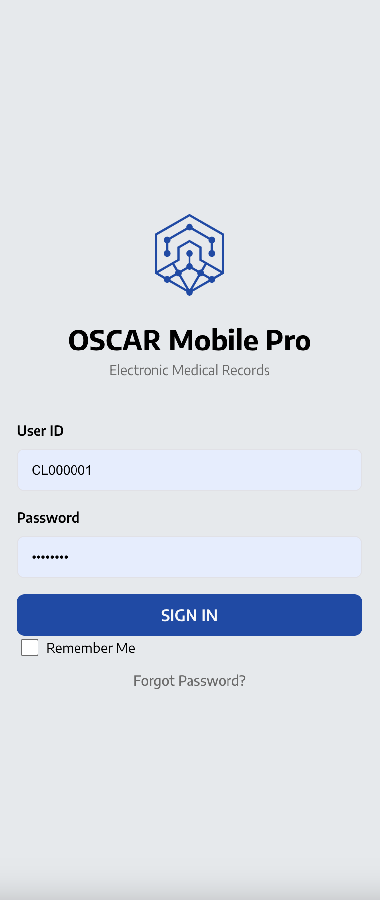

### Forgot Password

If you have forgotten your password, you can reset it to the default:

1. Tap **Forgot Password?** below the Sign In button.
2. A dialog will appear asking for your **User ID**.
3. Enter your User ID and tap **Reset Password**.
4. Your password will be reset to `oscar123`.
5. Sign in using the default password, then change it immediately (see [Section 10.2](#102-changing-your-password)).

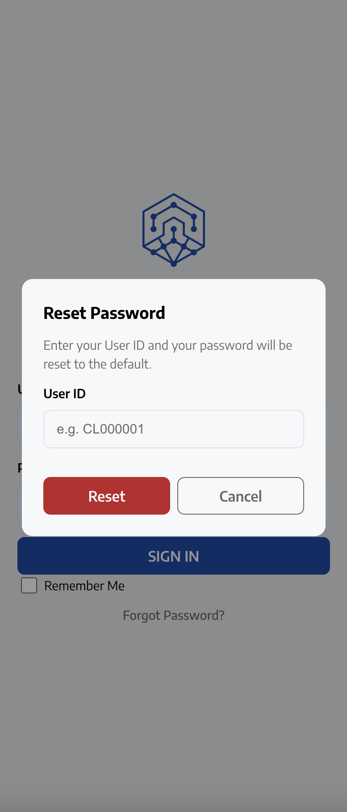

> **Security Tip:** After resetting your password, navigate to your Profile and change it to a unique, secure password right away.

---

## 5. Home Screen Overview

### Screen: Home

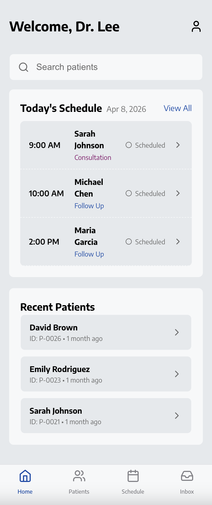

The Home screen is your daily dashboard. It gives you an at-a-glance view of your workload and quick access to the most common actions.

### Key Areas

| Area | Description |
|---|---|
| **Welcome Banner** | Displays your name and the current date |
| **Search Bar** | Search for any patient by name, patient ID, or gender |
| **Today's Schedule** | Shows appointments scheduled for today. Tap **View All** to open the full Schedule screen in Day view. |
| **Recent Patients** | Shows the last 3 patients you interacted with. Tap a card to open that patient's record. |
| **Profile Icon** | Top-right corner — tap to navigate to your Profile screen |

### Searching for a Patient from Home

1. Tap the **search bar** at the top of the Home screen.
2. Type the patient's name, ID (e.g., `P-0001`), or gender.
3. Matching results appear as you type.
4. Tap a result to open the **Patient Record**.

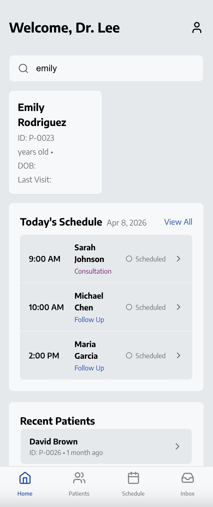

### Bottom Navigation Bar

The bottom navigation bar is visible on all main screens:

| Icon | Screen |
|---|---|
| House icon | Home |
| Person icon | Patients |
| Calendar icon | Schedule |
| Envelope icon | Inbox |
| Profile circle | Profile |

---

## 6. Managing Patients

### 6.1 Browsing the Patient List

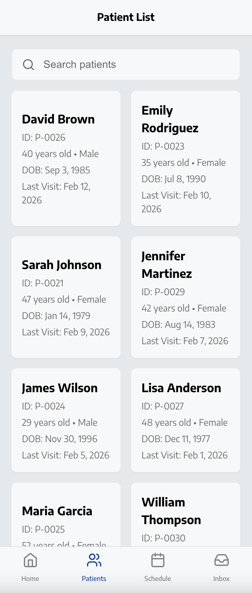

1. Tap the **Patients** icon in the bottom navigation bar.
2. The Patients screen shows all patients in a 2-column grid.
3. Each card shows the patient's name, ID, age, and gender.

#### Searching/Filtering

1. Tap the **search bar** at the top of the Patients screen.
2. Type any part of a patient's name, ID, or gender.
3. The grid updates live as you type.

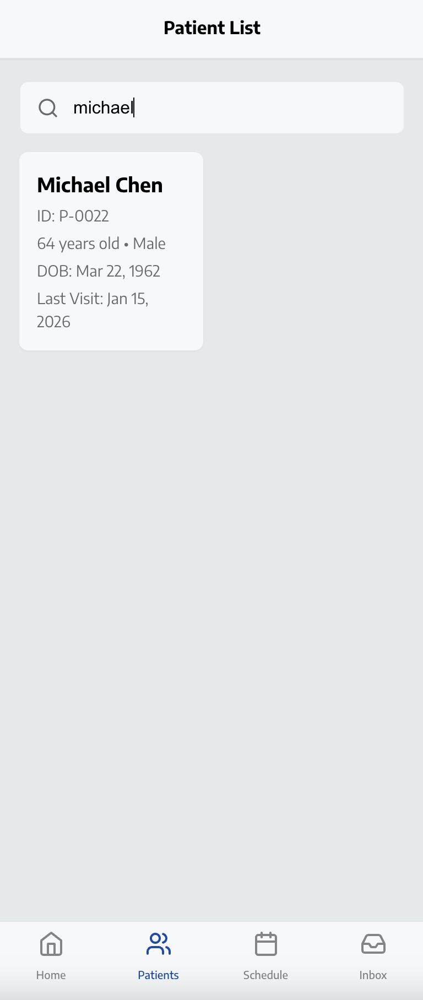

---

### 6.2 Viewing a Patient Record

1. Tap any patient card from the Patients list or Home screen.
2. The **Patient Record** screen opens, showing four tabs at the top:

| Tab | What it shows |
|---|---|
| **Summary** | Demographics, allergies, active medications, medical conditions, latest vitals, emergency contact |
| **Notes** | List of all clinical notes for this patient |
| **History** | Past appointment visits |
| **Vitals** | Historical vital sign readings |

3. Tap any tab heading to switch between views.
4. Tap the **back arrow** (top-left) to return to the previous screen.

#### Summary Tab — Key Information

- **Demographics:** Full name, date of birth, age, gender, phone, email
- **Allergies:** Listed as red tags (e.g., Penicillin, Peanuts)
- **Medications:** Name, dosage, and frequency for each active medication
- **Medical Conditions:** Diagnosed conditions (e.g., Hypertension, Type 2 Diabetes)
- **Latest Vitals:** Most recent blood pressure, heart rate, weight, and temperature
- **Emergency Contact:** Name, relationship, and phone number

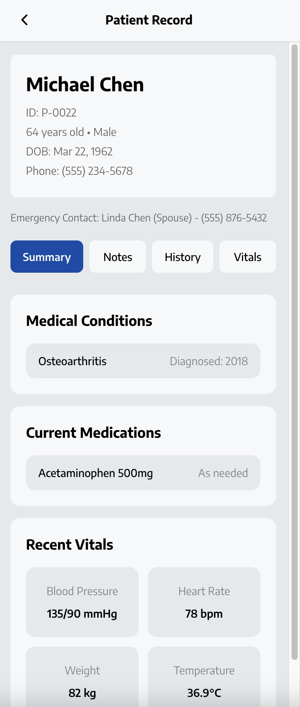

#### Notes Tab

- Shows a chronological list of clinical notes.
- Each entry shows the date, doctor name, note preview, and status (e.g., Synced).
- Tap any note entry to open the full **Clinical Note** (see [Section 8](#8-clinical-notes-soap-notes)).

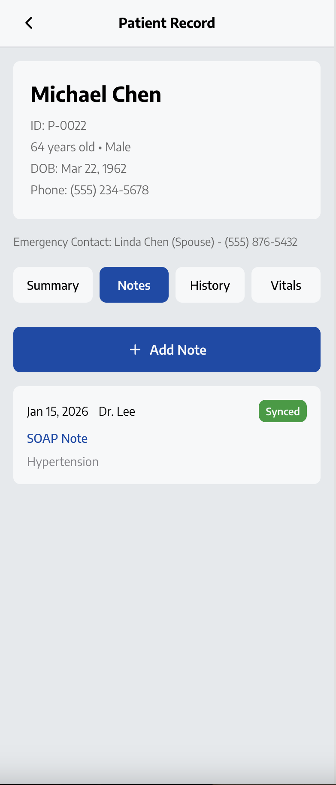

---

### 6.3 Viewing Appointment History

1. Open a **Patient Record** and tap the **History** tab.
2. Each row shows:
   - Date of the appointment
   - Visit type (e.g., Consultation, Follow-up)
   - Attending doctor's name
3. This is a read-only view of past visits.

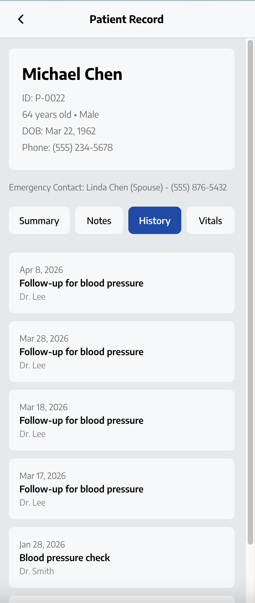

---

### 6.4 Viewing Vital Signs History

1. Open a **Patient Record** and tap the **Vitals** tab.
2. Each row represents one recorded visit and shows:
   - Date of measurement
   - Blood Pressure (e.g., 120/80 mmHg)
   - Heart Rate (e.g., 72 bpm)
   - Weight (e.g., 75 kg)
   - Temperature (e.g., 36.8°C)
3. Readings are listed from most recent to oldest.

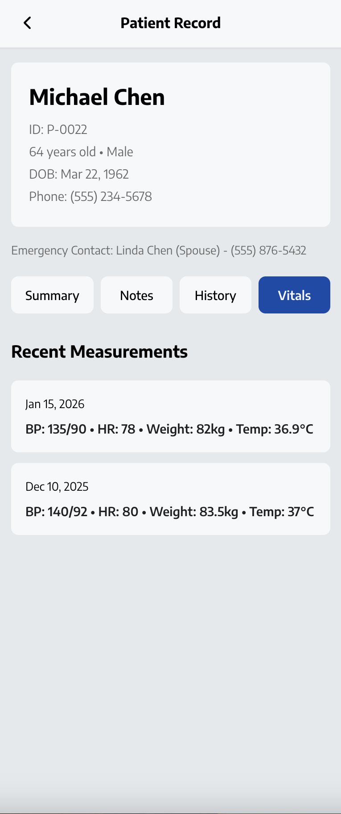

---

## 7. Managing Appointments (Schedule)

### 7.1 Navigating the Calendar

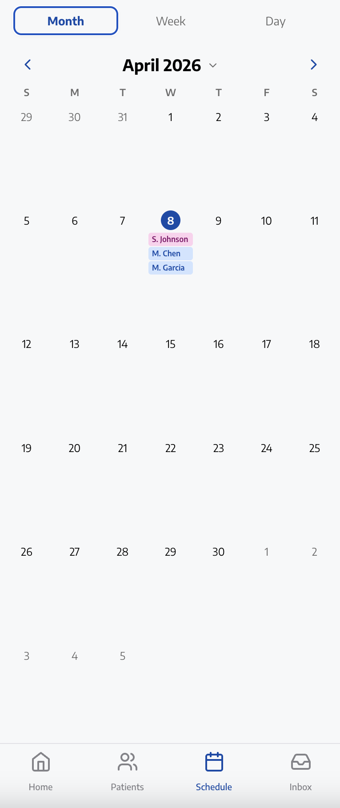

1. Tap the **Schedule** icon (calendar) in the bottom navigation bar.
2. The Schedule screen opens. You can switch between three views using the tabs at the top:

| View | Description |
|---|---|
| **Month** | Full calendar grid. Dates with appointments show a coloured dot. |
| **Week** | 7-day layout. Appointment blocks appear in their time slots. |
| **Day** | Hourly timeline for one day. Shows full appointment details. |

#### Switching Views

- Tap **Month**, **Week**, or **Day** at the top of the screen.
- In Month view, tap a specific date to jump to that day's **Day view**.

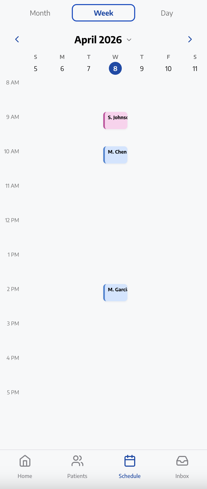

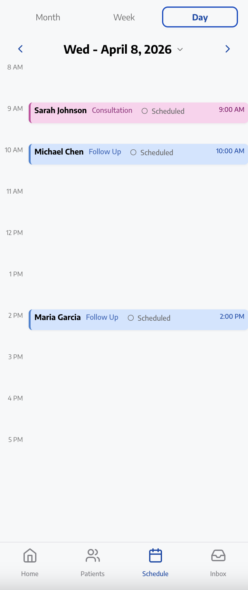

#### Moving Between Dates

- In **Month view:** Swipe left or right, or use the arrow buttons to navigate months.
- In **Week view:** Swipe left or right to move to the previous/next week.
- In **Day view:** Swipe left or right to move to the previous/next day.

---

### 7.2 Editing an Appointment

1. From any calendar view, tap an **appointment card** to open the **Edit Appointment** screen.
2. The screen shows the current appointment details:
   - Patient name
   - Appointment type (Consultation, Follow-up, Check-up, Procedure)
   - Status (Scheduled, Completed, Cancelled)
   - Date and time
   - Duration
   - Reason for visit
3. Tap any field to change its value.
4. Tap **Save & Sync** to apply your edits.

#### Updating Appointment Status

- Use the **Status** dropdown to mark an appointment as **Completed** after a visit, or **Cancelled** if needed.

> **Tip:** Completed appointments remain in the schedule as a historical record. They are also visible in the patient's History tab.

#### Adding a Clinical Note from an Appointment

- Scroll to the bottom of the Edit Appointment screen.
- Tap **Add Note** to create a new SOAP note linked to this appointment and patient (see [Section 8.1](#81-creating-a-new-clinical-note)).
- Existing notes linked to this appointment are listed here. Tap one to view or edit it.

---

### 7.3 Cancelling an Appointment

1. Open the appointment you wish to cancel (see [Section 7.2](#72-editing-an-appointment)).
2. Scroll to the bottom of the Edit Appointment screen.
3. Tap the **Cancel Appointment** button (shown in red).
4. Confirm the cancellation in the dialog that appears.
5. The appointment status updates to **Cancelled** and the record is preserved.

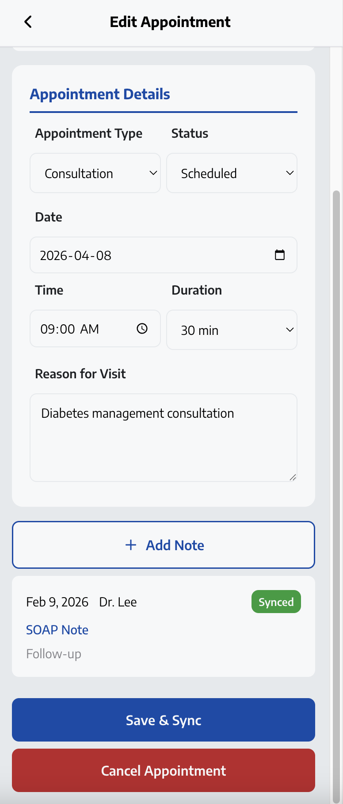

> **Note:** Cancellation cannot be undone from within the app. If an appointment was cancelled in error, contact your system administrator.

---

## 8. Clinical Notes (SOAP Notes)

Clinical notes follow the **SOAP format**: Subjective, Objective, Assessment, Plan.

### 8.1 Creating a New Clinical Note

**Recommended path:** From the Edit Appointment screen (links the note to the correct patient and appointment automatically).

1. Open the relevant appointment (see [Section 7.2](#72-editing-an-appointment)).
2. Tap **Add Note** at the bottom of the screen.
3. The **Clinical Note** editor opens.

Alternatively, navigate directly if you know the patient ID:
- The note form can be accessed via the Notes tab on a Patient Record.

#### Filling in the SOAP Note

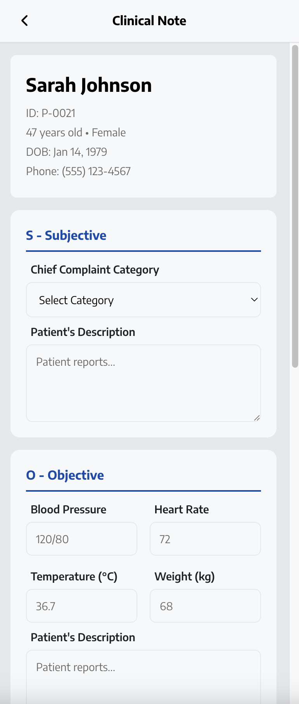

**Subjective Section**
- **Chief Complaint:** Brief description of the patient's main concern (e.g., "Chest pain for 2 days").
- **Patient Description:** Free-text field for the patient's own description of their symptoms.

**Objective Section**
- Enter the measured vitals:
  - Blood Pressure (e.g., `120/80`)
  - Heart Rate (e.g., `72`)
  - Temperature (e.g., `36.8`)
  - Weight (e.g., `75`)
- **Physical Exam Notes:** Free-text observations from the physical examination.

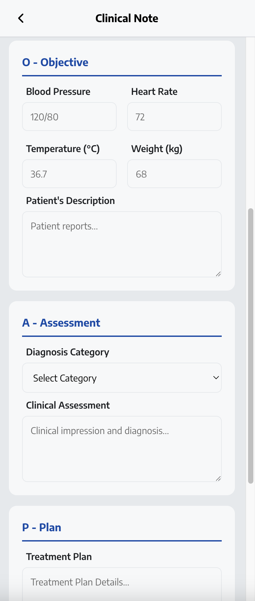

**Assessment Section**
- **Diagnosis Category:** Select from the dropdown (e.g., Cardiovascular, Respiratory, Musculoskeletal).
- **Clinical Assessment:** Free-text field for your clinical impressions and differential diagnoses.

**Plan Section**
- **Treatment Plan:** Free-text field describing the proposed plan.
- Check any applicable actions:
  - [ ] Medication Prescribed
  - [ ] Lab Test Ordered
  - [ ] Referral Made
  - [ ] Follow-up Required

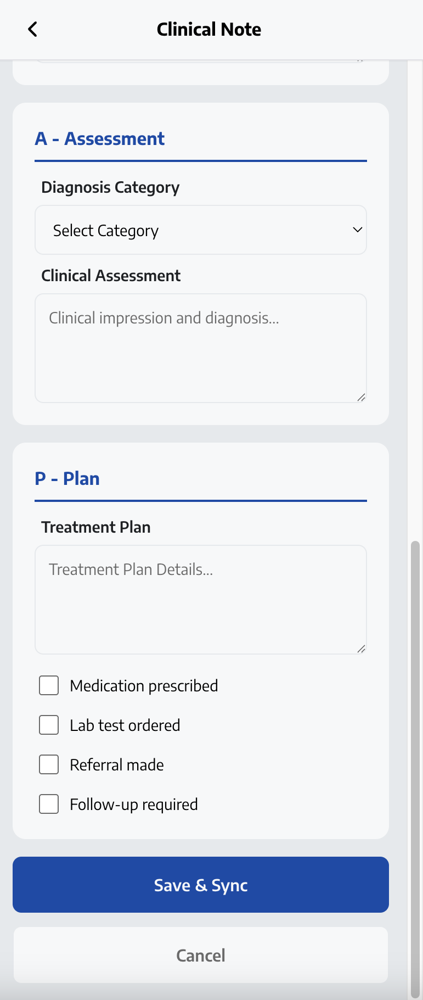

#### Saving the Note

1. Once all relevant sections are completed, tap the **Save** button.
2. A confirmation message appears: *"Note saved successfully."*
3. The note status updates to **Synced**.
4. The note now appears in the patient's **Notes** tab.

---

### 8.2 Editing an Existing Clinical Note

1. Navigate to the patient's **Notes** tab (via Patient Record) or open the note from the Edit Appointment screen.
2. Tap the note entry you wish to edit.
3. The Clinical Note editor opens with all existing content pre-filled.
4. Make your changes to any SOAP field or checkbox.
5. Tap **Save** to update the note.

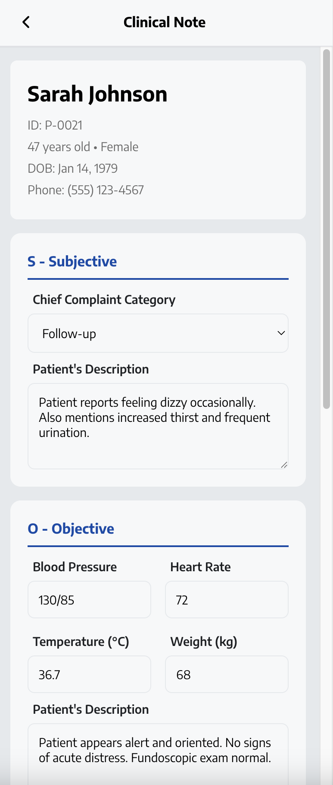

> **Important:** Editing a saved note updates the existing record. All changes are immediately reflected in the patient's Notes tab and the server.

---

## 9. Inbox & Messaging

### Screen: Inbox

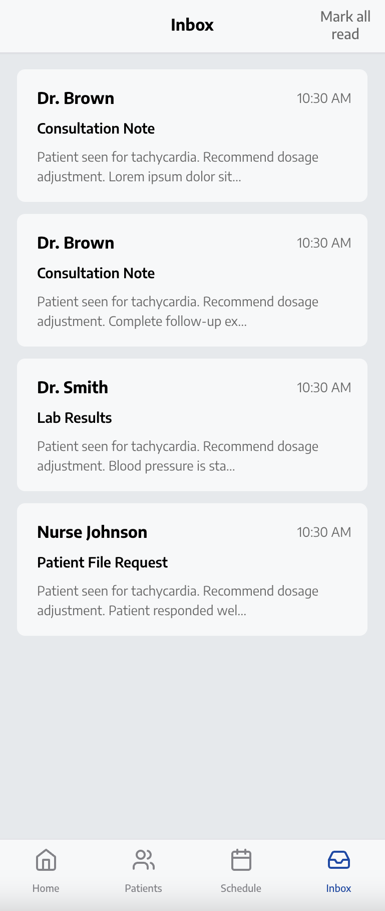

1. Tap the **Inbox** icon (envelope) in the bottom navigation bar.
2. The Inbox screen lists all messages received by you.

### Reading a Message

1. Each message in the list shows:
   - Sender name
   - Subject line
   - Preview of the message body
   - Timestamp
   - A **blue left border** indicates the message is **unread**.
2. Tap any message to expand it and read the full content.
3. The message is automatically marked as **read** when you open it (blue border disappears).

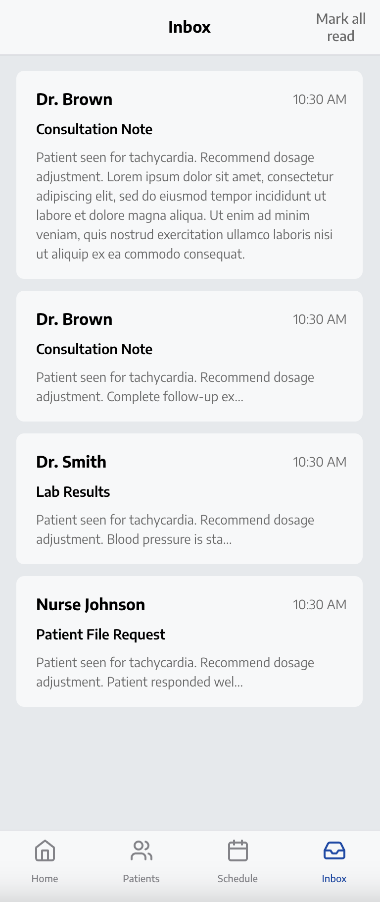

### Marking All Messages as Read

1. Tap the **Mark All as Read** button at the top of the Inbox screen.
2. All unread messages are immediately marked as read.

> **Note:** The message count badge on the Inbox tab icon updates after messages are marked as read.

---

## 10. Profile & Account Management

### 10.1 Viewing Your Profile

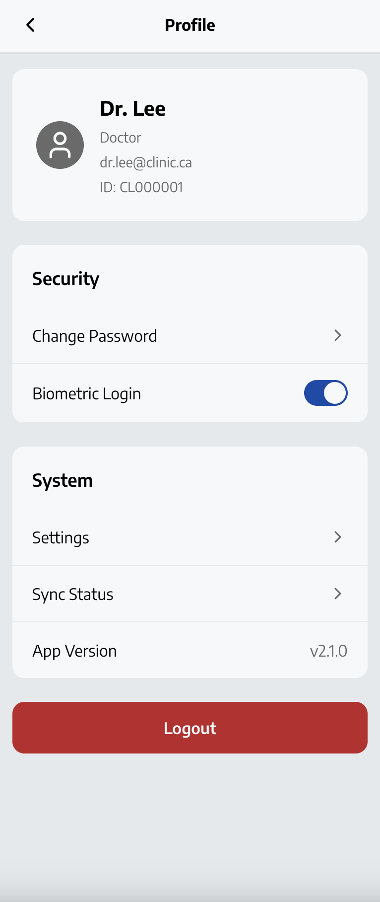

1. Tap the **Profile** icon in the bottom navigation bar, or tap the circular profile icon on the Home screen (top-right).
2. Your profile displays:
   - Full name
   - Specialty / Role (e.g., Family Medicine)
   - Email address
   - Clinician ID (e.g., CL000001)
   - Last sync timestamp

---

### 10.2 Changing Your Password

1. From the **Profile** screen, tap **Change Password**.
2. A dialog appears with three fields:
   - **Current Password**
   - **New Password**
   - **Confirm New Password**
3. Fill in all three fields.
4. Tap **Confirm** to save.
5. A success message confirms your password has been updated.

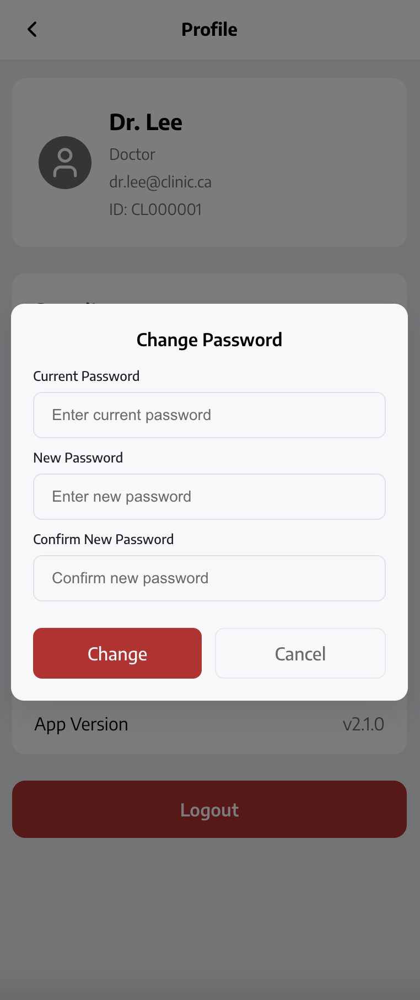

> **Security Tip:** Use a password that is at least 8 characters long and includes a mix of letters and numbers. Do not share your password with anyone.

---

### 10.3 Syncing Data

The application automatically syncs data when online. You can also trigger a manual sync:

1. From the **Profile** screen, tap **Sync Now**.
2. The app sends a sync request to the server.
3. The **Last Sync** timestamp at the bottom of the Profile screen updates to reflect the current time.

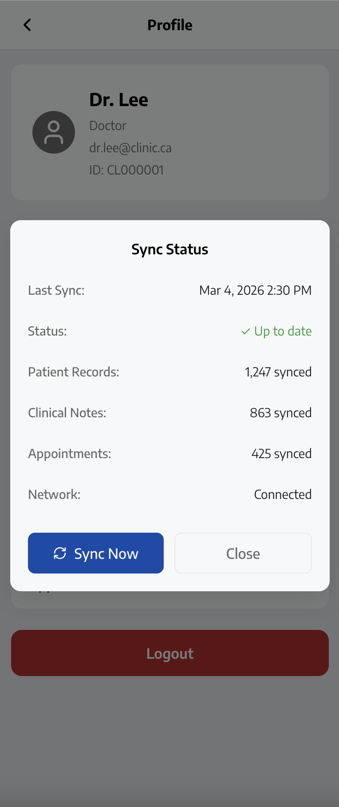

> **Tip:** If data appears outdated (e.g., an appointment you just updated is not reflecting changes), tap Sync Now to force a refresh.

---

### 10.4 Logging Out

1. From the **Profile** screen, scroll to the bottom and tap **Log Out**.
2. A confirmation dialog appears: *"Are you sure you want to log out?"*
3. Tap **Confirm** to log out.
4. You are returned to the **Sign In** screen.

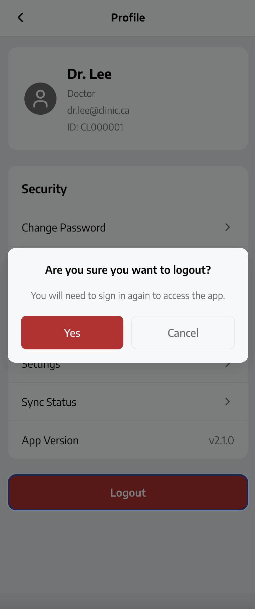

> **Important:** Always log out when leaving a shared device. Patient data is sensitive and must remain confidential.

---

## 11. Settings

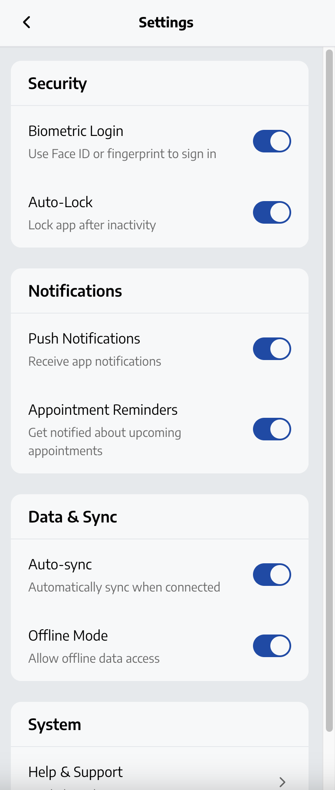

Access Settings from the **Profile** screen by tapping the **Settings** option.

Settings are organized into four categories:

### Security

| Setting | Description |
|---|---|
| **Biometric Login** | Enable Face ID / fingerprint login (if supported by your device) |
| **Auto-Lock** | Automatically lock the app after a period of inactivity |

### Notifications

| Setting | Description |
|---|---|
| **Push Notifications** | Receive push notifications for new messages and updates |
| **Appointment Reminders** | Get reminders before scheduled appointments |

### Data & Sync

| Setting | Description |
|---|---|
| **Auto-Sync** | Automatically sync data with the server in the background |
| **Offline Mode** | Enable offline mode to use the app without an active server connection (read-only) |

### System

| Setting | Description |
|---|---|
| **Help & Support** | Opens the Help screen with contact information |

### Saving Settings

All toggle changes are saved automatically as soon as you flip a switch. There is no Save button required.

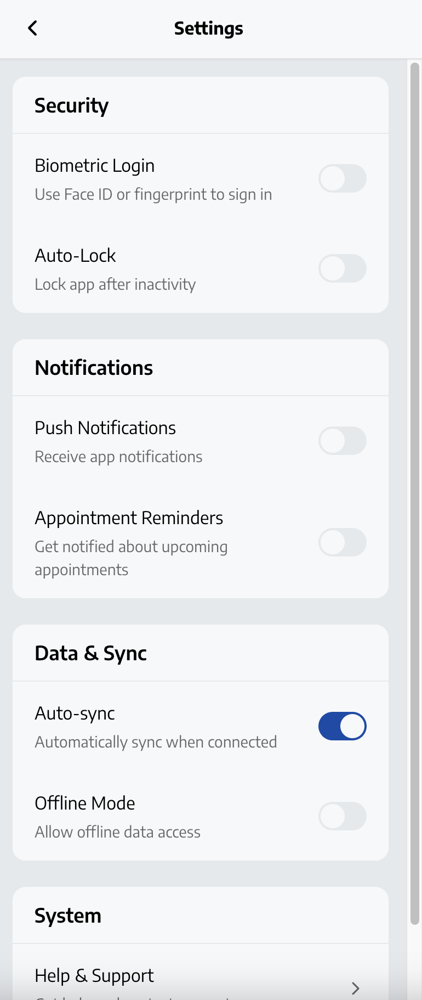

---

## 12. Help & Support

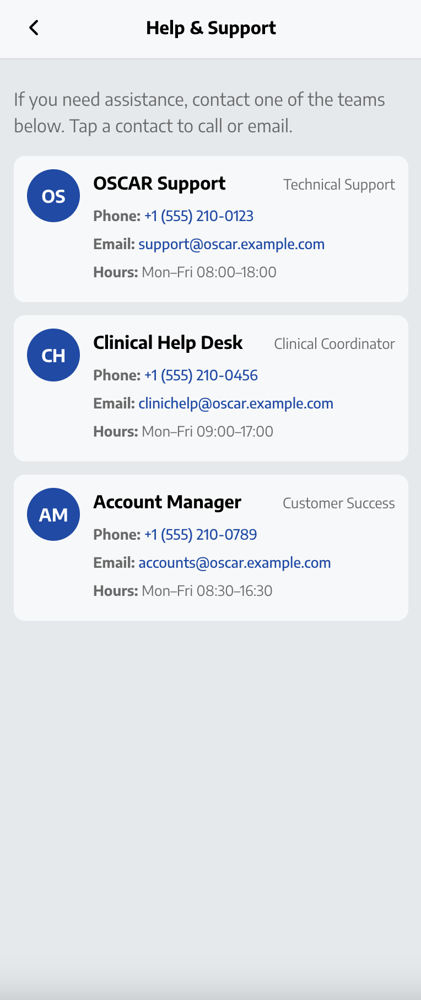

The Help screen provides direct contact information for technical and clinical support.

Access it by:
1. Going to **Settings** → **Help & Support**, OR
2. Navigating directly if your administrator has bookmarked the Help screen.

### Support Contacts

| Contact | Role | How to Reach |
|---|---|---|
| **OSCAR Support** | Technical issues (app errors, server, login) | Phone + Email link |
| **Clinical Help Desk** | Clinical workflow questions, patient data concerns | Phone + Email link |
| **Account Manager** | Account changes, user setup, licensing | Phone + Email link |

Tap a **phone number** to initiate a call (on mobile). Tap an **email address** to open your default email app with the address pre-filled.

---

## 13. Troubleshooting

### I cannot log in

| Symptom | Solution |
|---|---|
| "Invalid credentials" message | Double-check your User ID (e.g., `CL000001`) and password. Passwords are case-sensitive. |
| Forgot your password | Use the **Forgot Password?** link on the Sign In screen to reset to `oscar123`, then change it. |
| Page does not load at all | Confirm the server is running (`npm run dev`) and the URL is correct (`http://localhost:5173`). |

---

### The app shows no data / blank screens

| Symptom | Solution |
|---|---|
| Patient list is empty | The API server may not be running. Verify `npm run dev` was executed and the terminal shows no errors. |
| "Failed to load" error appears | The front-end cannot reach the API. Confirm the API is running on port `3001`. |
| Schedule shows no appointments | Appointments may not have been seeded. Re-run `npm run dev` to trigger the auto-seed. |

---

### Data I just saved is not visible

1. Tap **Sync Now** on the Profile screen (see [Section 10.3](#103-syncing-data)).
2. Navigate away from the screen and return to trigger a fresh data fetch.
3. If the problem persists, refresh the page in your browser (`F5` or `Cmd+R`).

---

### My password reset to default did not work

1. Confirm you entered the correct **User ID** (not your name — use the ID format `CL000001`).
2. If the User ID is not recognized, contact your **OSCAR Support** team (see [Section 12](#12-help--support)).

---

### The app appears slow or freezes

1. Check your network connection and ensure the server is responsive.
2. Refresh the browser page.
3. Clear the browser cache: Open browser settings → Clear browsing data → Cached images and files.
4. If the issue persists, restart the server (`Ctrl+C` to stop, then `npm run dev` again).

---

### A clinical note will not save

| Symptom | Solution |
|---|---|
| Error toast appears when saving | Ensure all required fields are filled: Chief Complaint, Diagnosis Category, and Treatment Plan are required. |
| Note saves but does not appear in the Notes tab | Navigate away and return to the Notes tab to refresh. Or tap Sync Now on the Profile screen. |

---

### Settings toggles reset after logging out

Settings are saved per-clinician in the database. If your settings appear to reset, it may indicate a sync issue. Ensure **Auto-Sync** is enabled in Settings before logging out.

---

### Biometric login is not working

1. Ensure **Biometric Login** is enabled in **Settings → Security**.
2. Biometric login requires browser and device support for the Web Authentication API.
3. If unsupported, use your User ID and password instead.

---

## 14. Glossary

| Term | Definition |
|---|---|
| **SOAP Note** | A structured clinical note format: Subjective, Objective, Assessment, Plan |
| **Clinician ID** | Unique identifier for a clinician (e.g., `CL000001`) |
| **Patient ID** | Unique identifier for a patient (e.g., `P-0001`) |
| **EMR** | Electronic Medical Records — digital records of patient health information |
| **Vitals** | Measured health indicators: blood pressure, heart rate, temperature, weight |
| **Sync** | The process of sending local data changes to the server (and receiving updates) |
| **OSCAR** | Open Source Clinical Application Resource — the EMR system this app is based on |
| **API** | Application Programming Interface — the backend service the app communicates with |
| **Offline Mode** | A setting that allows read-only access to cached data when no server connection is available |
| **Auto-Lock** | A security setting that locks the app after a defined period of inactivity |

---

*OSCAR Mobile Pro — User Technical Manual v1.0 | NovaLab Team | April 2026*
